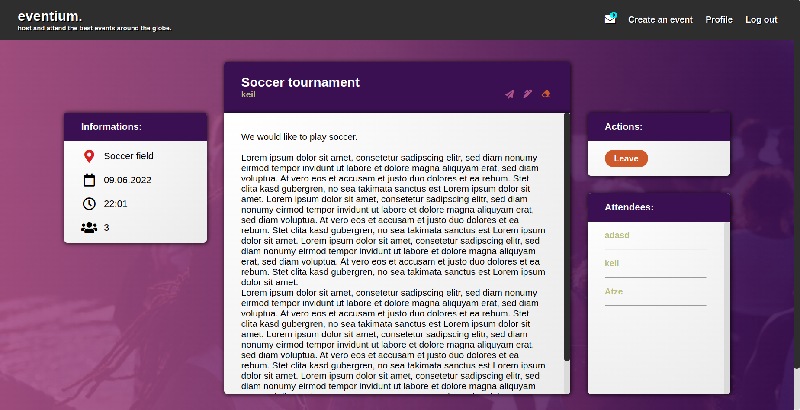

# eventium.

## Description
A project to dive into ActiveRecord’s associations. 
The project is a webapp with functionality to host or attend events.

## Demo
Link for eventium.  
note: it takes about 30 seconds for heroku to load the webapp.

### Demo test users
<strong>E-Mail:</strong> guest@guest.com 
<strong>Password:</strong> 123456

## Screenshots

